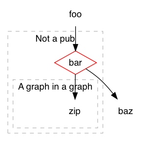

# What

graphspec (better name welcome) turns textual definitions of graphs (with edges and vertices, not chars or plots with axes and data points) into diagrams.
 
Here's a simple example:

```
foo --> bar
bar --> baz :: Because why not?
bar --> zip

..subgraph: bar.scope, Not a pub: bar, zip.scope
..subgraph: zip.scope, A graph in a graph: zip
..attr: bar: shape=diamond; color=red
```

If you pipe that through graphspec, it'll make something like this:



graphspec will ignore anything it doesn't recognize, so you can actually pipe it this README. 

# Why

graphspec builds on [Graphviz](http://www.graphviz.org/), which is easy to recognise in the above example if you're familiar with it. Graphviz uses its [dot language](http://www.graphviz.org/content/dot-language) to define graphs.

A simplified version of the dot generated for the above example is this:

```
digraph G {
    subgraph cluster_bar_scope {
        label="Not a pub"; style=dashed;
        
        subgraph cluster_zip_scope {
            label="A graph in a graph"; style=dashed;
            "zip";
        }
        "bar" [shape=diamond; color=red];
    }
    "bar" -> "baz" [tooltip="Because why not?"]
    "bar" -> "zip"
    "foo" -> "bar"
}
```

While Graphviz has more power than graphspec exposes, the dot language has a few drawbacks:

* It is not easily composable. You cannot easily combine data from different sources and produce a single output from it. That's largely because ...
* It is nested, and order and placement matters.
* It is verbose and not something you'd include in e.g. source code or documentation.

Composability is the most important for graphspec to exist. Graphs detailed enough to actually convey a lot of detail will get large and unwieldy. This tools is intended to be use in combination with e.g. grep or ripgrep, which would do any filtering/selection prior to feeding to graphspec.

Not being verbose is a second important trait. The "language" is intended to not be noisy. The most important part of graphspec are edge definitions, such as `Start --> End`, which are subtle enough to be scattered across source code comments and documentation.
 
 In fact, the goal is to have the edges be maintained right next to the implementations of the concepts they graph. For example, a terraform file defining a load balancer could embed a comment like `load-balancer --> app-server`.
 
 The edges are intended to be further enriched with subgraph assignments, styling, etc. This can happen anywhere and not necessarily right next to its definition. Documentation that goes deeper into the meaning of the edges, its implications, why it is, scoping via subgraphs etc. is an excellent place to assign most of the statements. Asciidoc and Markdown both support including comments, as in source code comments.
  
 # How
 
 graphviz can be run in two modes:
 * It'll either output a single file and exit, if you invoke it with `--html`, `--dot`, `--png`, `--pdf`, or `--svg`. Of these, the HTML output (which embeds an SVG) is probably the most useful, as it's interactive.
 * It can also start a simple web-server, which expects you to provide it with a file defining graph profiles. The profiles combine a simple description with a way to source the input.

When working on graphs the serve mode is probably the most useful, as that lets you open up a graph in your browser and refresh to see your changes.

The HTML version includes some Javascript to let you interact with the graph.

# Language

graphspec looks for edge definitions and statements. There can be multiple edge definitions in a single line of input, but just one statement. Also note that comments go on to the end of a line.

Here's all the possible way to define edges:

* `start --> end` makes an edge from `start` to `end`
* `start --> end :: This is a comment on why this edge is a thing, it'll show up if you hover over it`
* `..attr: start --> end, Label: color=red; style=dashed :: Edge with custom styling and a comment`

The last one is a statement.

Note that the arrow has two dashes, not just one like Graphviz. This is to not make it easily clash with e.g. map definitions in Scala.

Statements start with `..` and a directive, typically `attr` or `subgraph`.

Examples:

* A bit of everything: `..attr: start, pretty label for the start node: shape=diamond; color=blue :: Comment for the node`
* No label or comments: `..attr: start: shape=box`
* `..attr: start: :: Empty data, no label, just a comment`
* `..subgraph: subgraph, Label: a, b, c`

The `attr` directive takes a node id or an edge, an optional comma-separated label, followed by a colon and attributes for the node/edge. These can be any valid Graphviz attribute. Comments can optionally be added, they'll be anything following `::`.

The `subgraph` directive is used to organise _nodes_ into subgraphs. A subgraph can contain other subgraphs, but a node (and a subgraph) can only be contained by a single subgraph. It needs to form a tree.

It's invoked as `..subgraph: idOfSubgraph, Optional Label: child1, child2, ...`

Example:

```
A --> B
B --> C
C --> D

..subgraph: b.scope, Bs and Cs: B, c.scope
..subgraph: c.scope: C
```

This will leave A and B out of anything, and there will be a scope containing B and the C-scope, which in turn contains C.

# Requirements

graphspec needs Python and Graphviz, and having ripgrep is a good idea too.

A few Python modules are necessary, you can `pip install -r requirements.txt` to get those.

# TODO

* Filters
* Details on transitive reduction. Hint: Add `?apply_transitive_reduction=true` to a request, e.g. `http://localhost:8008/profile?apply_transitive_reduction=true`
* Make it possible to make a comment be the entire line that follows e.g. ":::"? So it's possible to do `::: \n Prose that's part of the documentation, and not just a comment`?